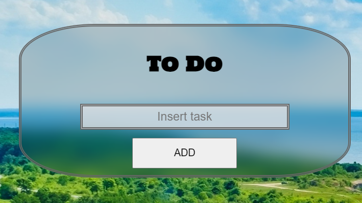
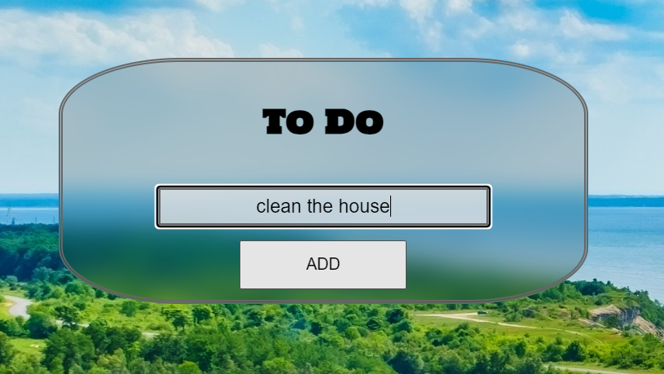
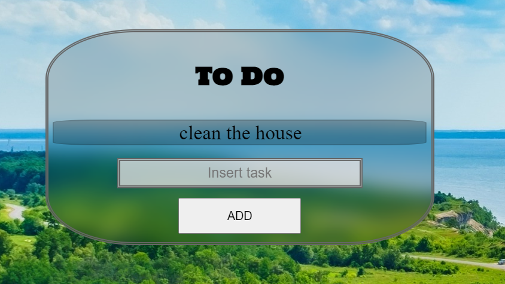
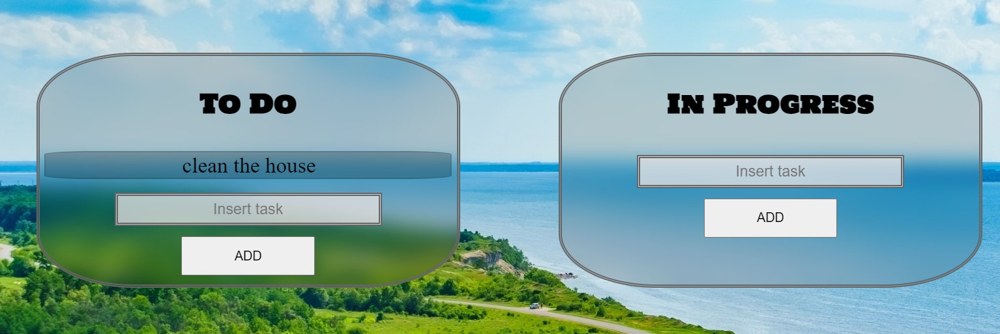
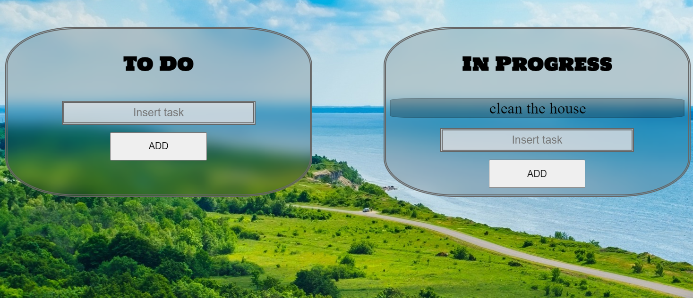

# Cyber4s 3rd Pre-Course Final Project

## What I Done In This Project 

Welcome to my pre-course final project. In this project, I built a webpage for task manager. 
To make this webpage I used Javascript, CSS, and HTML languages. 


### Page Structure

There are 3 sections of tasks on my page: tasks to do, tasks in progress, and done tasks. 
In each tasks section, there is a button and text area to insert new tasks. 
Also, there is a text area above the sections of the tasks that is used to search combinations of chars in the tasks.
In addition, I add two buttons to the upper section of the page that can load and save tasks from the API 
[I will detail later how things happen on the page]

### Add Task 
- [ ] This is how a tasks section looks like when it is empty

- [ ] To add a task, the user needs to click on the text area and type a task

- [ ] When the user clicks on the Add button the page add the task to the tasks section


### Move Task Between Sections 
- [ ] If the user wants to move a task from section to other section he can do it by hover on a task and click two buttons: alt + number that represents the section the user wants the task move to. 
 
 
 
### Search Combination On The Tasks
- [ ]
### Storage

- [ ] The data of all the tasks  saved to `localStorage` following any changes made to the data. The data  saved under a storage key named `tasks`. It saved in the following format :

```json
{
  "todo": [],
  "in-progress": [],
  "done": []
}
```

- [ ] Even if there are no tasks, there still a `tasks` key in the `localStorage`, in the above format (the arrays will just be empty).


